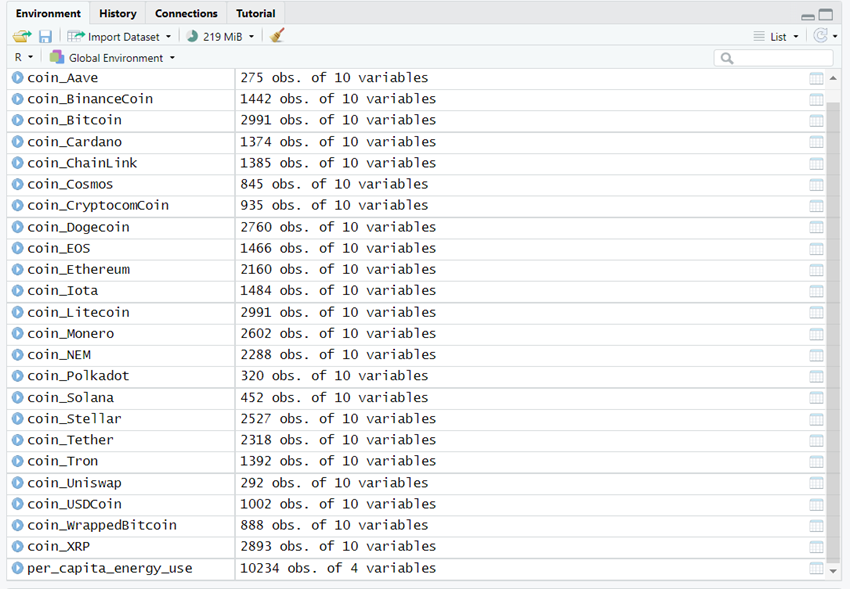
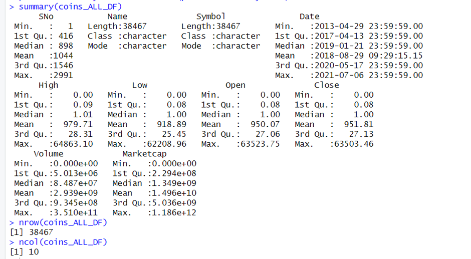
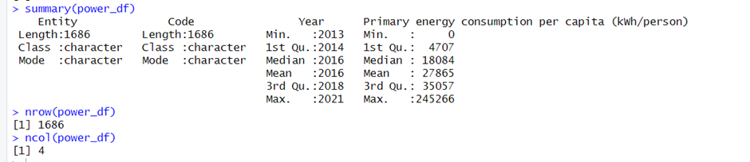

```{r setup, include=FALSE}
knitr::opts_chunk$set(echo = TRUE)
source('DataFrame-Management.r')
```

## Parte I

### PLANTEAMIENTO DEL PROBLEMA

>El progresivo desarrollo tecnológico, particularmente en los últimos veinte años, ha tenido un gran impacto sobre la biósfera y la sociedad en general. Ahora que se encuentra socialmente, ante la transición del dinero físico al dinero digital, es preciso evaluar las consecuencias de un cambio tan significativo. 
>Lo cierto es que, si bien las criptomonedas brindan la oportunidad de acceder a un sistema transparente, descentralizado y seguro para efectuar transacciones, también representan un importante elemento a considerar cuando se refiere, al aumento del consumo eléctrico mundial. 
De acuerdo a la Oficina de Política, Ciencia y Tecnología (2022), perteneciente al departamento del gobierno de los Estados Unidos: 
>
>>*Casi todo el consumo de electricidad de los cripto activos es impulsado por los mecanismos de consenso: la tecnología de contabilidad distribuida (DLT) utilizada para minar y verificar los cripto activos. El mecanismo de consenso dominante se llama Prueba de Trabajo (PoW), que es utilizado por las cadenas de bloques Bitcoin y Ethereum. Bitcoin y Ether combinados representan más del 60% de la capitalización total del mercado de los cripto activos. El mecanismo PoW está diseñado para requerir más poder de cómputo a medida que más entidades intentan validar transacciones para obtener una pequeña comisión en monedas, y esta característica ayuda a desincentivar a los actores malintencionados de atacar la red. A partir de agosto de 2022, se estima que Bitcoin representa del 60% al 77% del consumo total de electricidad de los cripto activos a nivel mundial, y Ethereum representa del 20% al 39%.*
>
>La eficiencia energética de estas máquinas ha aumentado, no obstante, el consumo eléctrico continúa aumentando. Asimismo, esto implica grandes emisiones CO2, uno de los principales gases responsables del efecto invernadero. Según lo investigado por Apraez et al. (2022), el Bitcoin es un claro ejemplo del impacto ambiental de las criptomonedas: 
>
>> En  los  últimos  dos  años,  el  aumento  histórico  de bitcoin  ha  provocado  que  las emisiones aumenten en más de 40 millones de toneladas, lo que equivale a 8,9 millones de automóviles agregados a las calles, impulsando el calentamiento global por encima de 2°C (p. 4). 
>
>El impacto ambiental de estos cripto activos no es un factor que la mayoría de las personas consideran al momento de invertir, sin embargo, esto se debe en gran medida al desconocimiento y lo poco tangible que resulta dicho fenómeno. Asimismo, existen pocas fuentes que permitan establecer una relación entre el consumo eléctrico y las muchas criptomonedas en existencia. Por ende, el presente proyecto plantea realizar comparaciones entre el consumo energético y el mercado de las criptomonedas (valores y transacciones)


### PROPUESTA

>El presente proyecto propone la elaboración de un sistema a través del cual el usuario pueda visualizar gráficamente la relación entre las criptomonedas y el consumo energético. Para ello se utilizaron dos bases de datos: 
>
>1. Histórico de precios de criptomonedas. Este dataset, obtenido de Kaggle, contiene información sobre las principales criptomonedas en el mercado actual. 
>
>2. Uso energético per cápita (per_capita_energy_use). Our World Data se dedica a publicar datos relacionados a los principales problemas del mundo, siendo el alza en el consumo eléctrico uno de ellos. Dicho dataset incluye el uso energético mundial por persona hasta el año 2021.  

>En total, se emplearon los siguientes datos: 



>Como puede observarse, cada base de datos de criptomonedas posee diez variables. Estas son: SNo, Name, Symbol, Date, High, Low, Open, Close, Volume y Marketcap. Mientras que per_capita_energy_use tiene cuatro variables: Entity, Code, Year y Primary energy consumption per capita (kWh/person). Para el propósito de este proyecto, se dio prioridad a las variables relacionadas con el valor y volúmen de transacciones de criptomonedas, y también al consumo de energía per capita. Esto con la finalidad de establecer una relación que permita comprender -aunque de manera muy básica- el impacto de los cripto activos en términos ambientales.


### JUSTIFICACIÓN

>La orientación al progreso y al desarrollo tecnológico son dos aspectos que caracterizan a la sociedad contemporánea, no obstante, esto constituye un problema cuando se desestima el impacto ambiental de sus hazañas. A pesar de que las ventajas de las transacciones con criptomonedas son muchas y representan el futuro de la economía mundial, el alto costo energético es imposible de ignorar.
>
>En tal sentido, es preciso tomar conciencia, adoptar alternativas y realizar mejoras. El presente proyecto pretende dar un primer paso, aportando una visualización clave del problema que motive al usuario a seguir investigando y a tomar decisiones más conscientes al momento de invertir en activos digitales. 


## Parte II

### HALLAZGOS

>Una vez obtenidas las bases de datos señaladas anteriormente, se procedió a la tarea de limpieza. En esta etapa consistió en agrupar la totalidad de la data respectiva a las criptomonedas en un mismo vector titulado “coins_ALL_Vector” con el propósito de hacer más cómodo el proceso. Posteriormente, dicho vector fue reescrito como un dataframe denominado “coins_ALL_DF” compuesto de la información almacenada en cada una de las listas que constituyen “coins_ALL_Vector”: 
 


>Por otro lado, para limpiar la base de datos correspondiente al uso energético per cápita (per_capita_energy_use), se eliminaron los valores con NA contenidos en ella y se filtraron los años para coincidir con la información acerca de los criptoactivos. Al igual que en el caso anterior, el resultado final fue guardado en un dataframe denominado “Power_DF”: 


>A través de los gráficos y el resumen estadístico obtenido, surgen preguntas acerca del auge de las criptomonedas, el uso de electricidad a nivel mundial y la relación entre ambos elementos. En tal sentido, al cuestionarse, ¿por qué se da un aumento en el consumo y de las transacciones?

>Sobre el aumento del valor de las criptomonedas: Desde el 2013, resulta evidente el incremento en la demanda del uso de las criptomonedas. Tanto a las personas como a las empresas perciben un beneficio al utilizarlas, sobre todo en relación al intercambio de bienes y servicios, rapidez en cambio de cualquier tipo de activos de forma inmediata y el bajo porcentaje en comisiones por transacción, etc.

```{r grafico1, echo=FALSE}
value

```



>En cuanto al volumen de transacciones con criptomonedas, los datos indican un aumento significativo de estas. Para el año 2017 es donde se evidencia un salto importante en las transacciones. Se pueden establecer muchas hipótesis que la explican, sin embargo, en nuestro caso, se destaca el alto consumo, sus beneficios y el incremento en su publicidad como posibles razones. Como se evidencia en el gráfico, el uso de los cripto activos se ha reforzado desde entonces. 

```{r grafico3, echo=FALSE}
volumen

```

>Por otro lado, el gráfico a continuación denota una diferencia en el consumo eléctrico per cápita desde del año 2020; posiblemente a razón la pandemia de COVID-19 puesto que las personas estuvieron la mayoría del tiempo en casa, consumiendo así una mayor cantidad de energía eléctrica. Otra de las razones por las cuáles ha aumentado el consumo eléctrico es la masificación de las transacciones con criptomonedas, en tanto las máquinas destinadas a mantener el sistema deben estar conectadas en todo momento. Es preciso mencionar que estos cambios se dieron en un corto plazo. Si bien esto representa un claro beneficio para las compañías eléctricas, el aumento del consumo también implica importantes consecuencias ambientales que aún deben ser estudiadas en profundidad.

```{r grafico2, echo=FALSE}
power

```



>En cuanto al valor de las criptomonedas y el consumo eléctrico, se realizó el gráfico que se observa a continuación: 

```{r grafico4, echo=FALSE}
power_value

```

>Existe una pronunciada pendiente positiva en la función, no obstante, hasta cierto punto esta pierde su fuerza. Una de las muchas razones se debe a la estabilidad del mercado y también la situación del aumento de las tasa de los EEUU, factores que alteraron tanto su valor promedio como su consumo,porque las criptomonedas van de la mano con el crecimiento de la economía de los EEUU. 

>Finalmente, se estableció, a través de un gráfico de línea, la relación entre el volúmen de transacciones y el consumo eléctrico per cápita. Como puede observarse, existe una pendiente positiva muy pronunciada a lo largo del tiempo como consecuencia del aumento de su uso y su popularidad. La ligera variación y posterior estabilidad de la pendiente se debe al aumento de ambas variables. Es decir, a medida que se realizan más transacciones con criptomonedas, el consumo eléctrico aumenta en igual proporción.

```{r grafico5, echo=FALSE}
power_volume

```

>La evidente relación entre el consumo eléctrico y las transacciones con criptomonedas no es un tema tan sencillo como quizás pueda inferirse de este breve informe exploratorio. En tal sentido, es indispensable que se planteen algunas preguntas para avanzar en otra ocasión con el estudio del impacto ambiental de los cripto activos: ¿Cómo se compara el consumo eléctrico por transacciones con criptomonedas al consumo eléctrico total de países como China, EEUU o Rusia? ¿Cuál es la totalidad de CO2 emitido a la atmósfera como producto de esta actividad? ¿Cómo se compara el impacto de las criptomonedas con otras industrias contaminantes? 


## REFERENCIAS 

- [The White House. (2022, Septiembre 08). Climate and Energy Implications of Crypto-Assets in the United States.]( https://www.whitehouse.gov/ostp/news-updates/2022/09/08/fact-sheet-climate-and-energy-implications-of-crypto-assets-in-the-united-states/)
- [Apraez Muñoz, J. J., Guaitarilla Moncayo, D. F., & Muñoz Gómez, C. A. (2022). Análisis del impacto ambiental por el consumo energético en la producción del bitcoin a nivel mundial. LOGINN Investigación Científica Y Tecnológica, 6(2).]( https://doi.org/10.23850/25907441.4800)
- [Cryptocurrency Historical Prices | Kaggle](https://www.kaggle.com/datasets/sudalairajkumar/cryptocurrencypricehistory?resource=download)
- [Energy Production and Consumption - Our World in Data](https://ourworldindata.org/energy-production-consumption)
- [GitHub: Proyecto de Ciencia de datos](https://github.com/AitorParr/Ciencia-De-Datos/tree/main)
